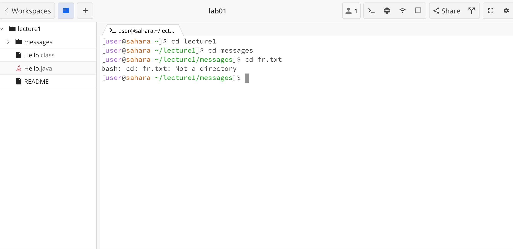
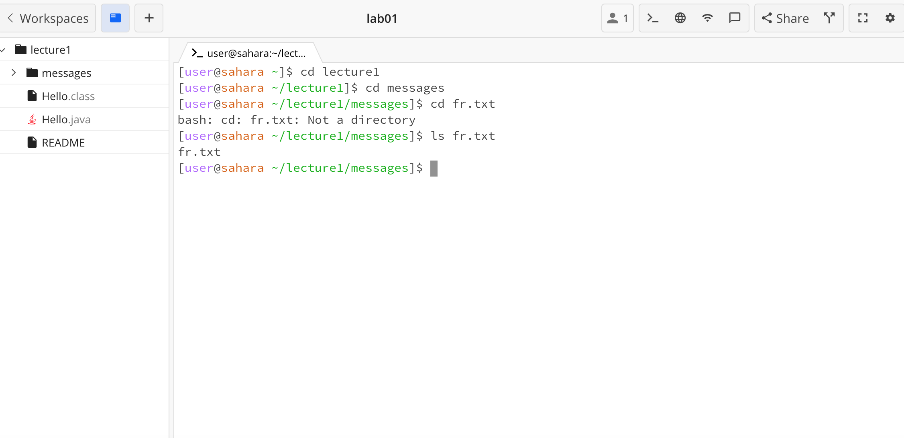
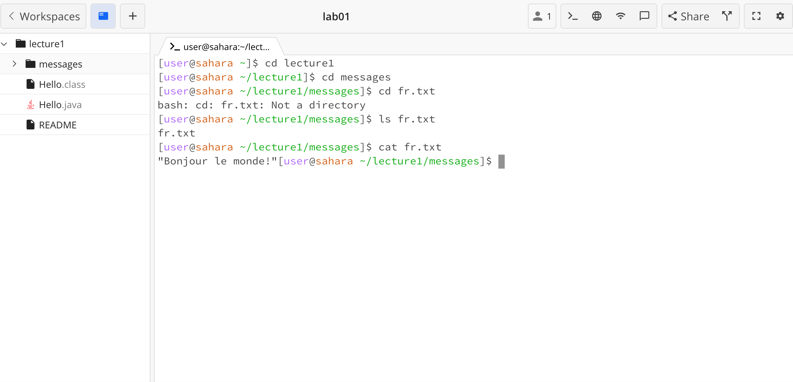

## Lab Report 1

Running the following commands: ```cd```, ```ls```, and ```cat``` with no argument, with a path to a directory as an argument, and a path to a file as an argument. 

1. ```cd``` with no argument

This is not an error, as the command to change directory will just return the user to the home directory if no argument is given. Working directory when the command was run: /home/lecture1

2. ```ls``` with no argument

This is not an error, ls will print all the files in the current directory even without an argument, in this example since there was nothing in the current directory the output was empty. Working directory when the command was run: /home

3. ```cat``` with no argument

This is not an error, as cat with no argument will take user input and echo it back to the command line. Have to use control + c to exit the terminal. Working directory when the command was run: /home

4. ```cd``` to directory

This is not an error, it changed the working directory from home to the directory included in the argument - lecture1. Working directory when the command was run: /home

5. ```ls``` of directory

This is not an error, it shows all the contents of this directory including other directories and files, it will work with or without an argument as long as the directory is not empty. Working directory when the command was run: /home/lecture1

6. ```cat``` of directory

This is an error, as the cat command only works on files not directories. Working directory when the command was run: /home/lecture1

7. ```cd``` to file

This is an error, as the cd command only works for directories not files. Working directory when the command was run: /home/lecture1/messages

8. ```ls``` of file

This is not an error, it just outputs the same file as there is nothing else in the file. Working directory when the command was run: /home/lecture1/messages

9. ```cat``` of file

This is not an error, it prints out the contents of the file and works on multiple files given in the same argument. Working directory when the command was run: /home/lecture1/messages
