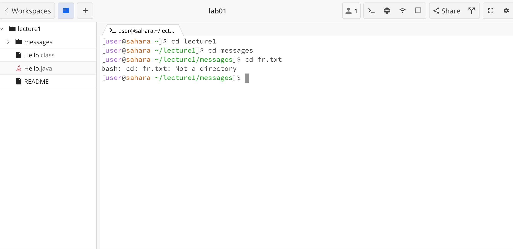
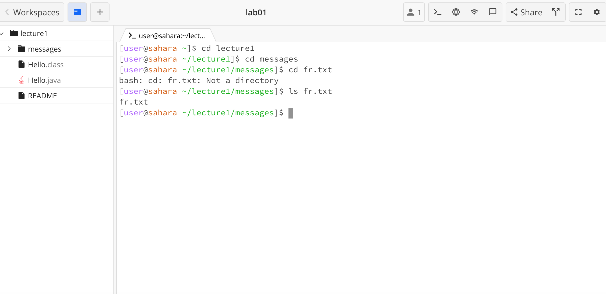
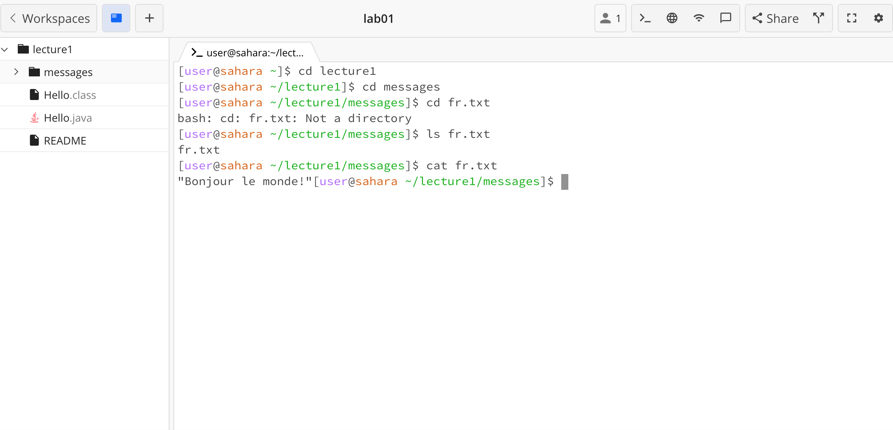

## Lab Report 1

Running the following commands: ```cd```, ```ls```, and ```cat``` with no argument, with a path to a directory as an argument, and a path to a file as an argument. 

1. ```cd``` with no argument

This is an error since the command to change directory cannot exceute without being given another directory to move to.

2. ```ls``` with no argument

This is not an error, ls will print all the files in the current directory even without an argument, in this example since there was nothing in the current directory the output was empty.

3. ```cat``` with no argument

This is an error, as cat will print out what is present in a file. Had to use control + c to exit the terminal.

4. ```cd``` to directory

This changed the working directory from home to the directory inlcuded in the argument - lecture1.

5. ```ls``` of directory

This shows all the contents of this directory inlcuding other directories and files, it will work with or without an argument as long as the directory is not empty.

6. ```cat``` of directory

This shows an error as the cat command only works on files not directories.

7. ```cd``` to file

This is an error as the cd command only works for directories not files.

8. ```ls``` of file

This just outputs the same file as there is nothing else in the file.

9. ```cat``` of file

This prints out the contents of the file and work on multiple files given in the same argument.
