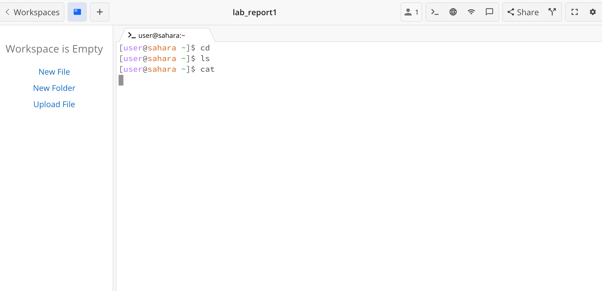

## Lab Report 1

Running the following commands: ```cd```, ```ls```, and ```cat``` with no argument, with a path to a directory as an argument, and a path to a file as an argument. 

1. cd with no argument

2. ls with no argument

3. cat with no argument

4. cd to directory

5. ls of directory

6. cat of directory

7. cd to file

8. ls of file

9. cat of file

