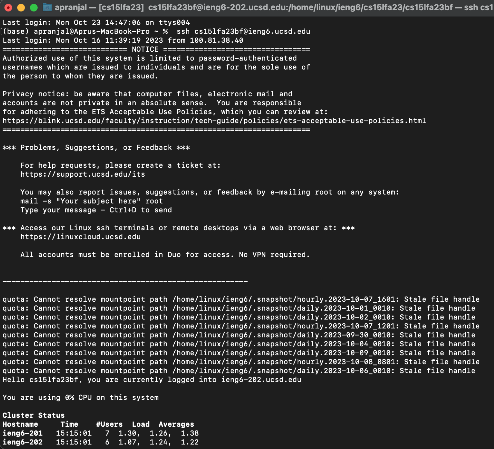

## Lab Report 2

**Part 1:**

1. String Server Code:
```

import java.io.IOException;
import java.net.URI;

class Handler implements URLHandler {
    // The one bit of state on the server: a number that will be manipulated by
    // various requests.
    int num = 0;
    String str = "";
    int counter = 1;

    public String handleRequest(URI url) {
        if (url.getPath().equals("/")) {
            return String.format("Apru's Number: %d", num);
        } else if (url.getPath().equals("/increment")) {
            num += 1;
            return String.format("Number incremented!");
        } else {
            if (url.getPath().contains("/add")) {
                String[] parameters = url.getQuery().split("=");
                if (parameters[0].endsWith("s")) {
                    str += counter + ". " + parameters[1].replace("%20", " ") + "\n";
                    counter ++;
                    return str;
                }
            }
            return "404 Not Found!";
        }
    }
}

class SearchEngine {
    public static void main(String[] args) throws IOException {
        if(args.length == 0){
            System.out.println("Missing port number! Try any number between 1024 to 49151");
            return;
        }

        int port = Integer.parseInt(args[0]);

        Server.start(port, new Handler());
    }
}

```

2. "Hello" Webserver Example

The method `handlerequest` is called and the relevant argument is the second if statement which checks for "/add" in the URI input, then prints out whatever is in the query after that. The counter is used for the `int` portion which formats the output by adding its value in front of the string. In this first example, we see "1. Hello" is printed.

4. "How are you?" Webserver Example

Similarly, the method `handlerequest` is called and the relevant argument is the second if statement which checks for "/add" in the URI input, then prints out whatever is in the query after that. The counter is used for the `int` portion which which formats the output by adding its value in front of the string. Here the URI remains the same until we get to the query as we have a phrase instead of a single word in the message. Hence, it extracts the new query and the counter is incremented and because the first string is also saved, the next counter value is used to format the output. Now we see "1. Hello" and "2. How+are+you?" is printed below it in a new line.


**Part 2:**

1. Path to the private key for SSH key:


3. Path to the public key for SSH key:


5. Logging into ieng6 without password:


**Part 3:**

In week 2 and 3 I learned how to create an ssh key pair and login to a remote server without a password which was both new to me. I often use ssh for tasks and would enter my password each time so this is a more efficient login process I am excited to keep using.
