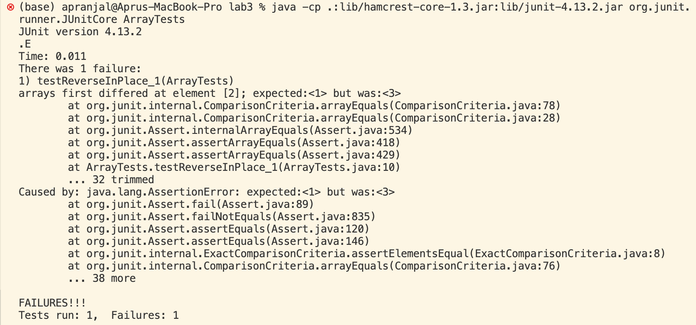
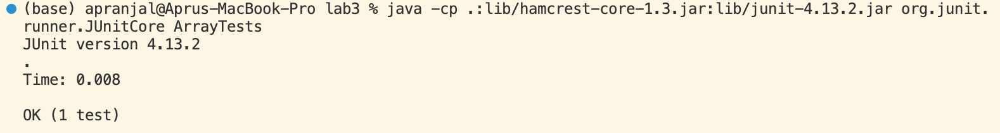
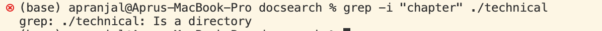
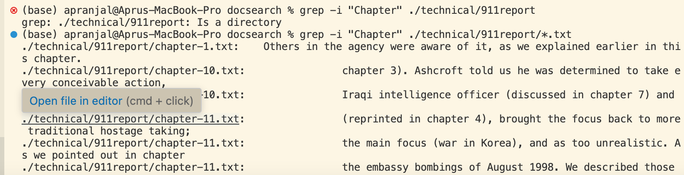
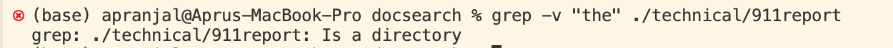
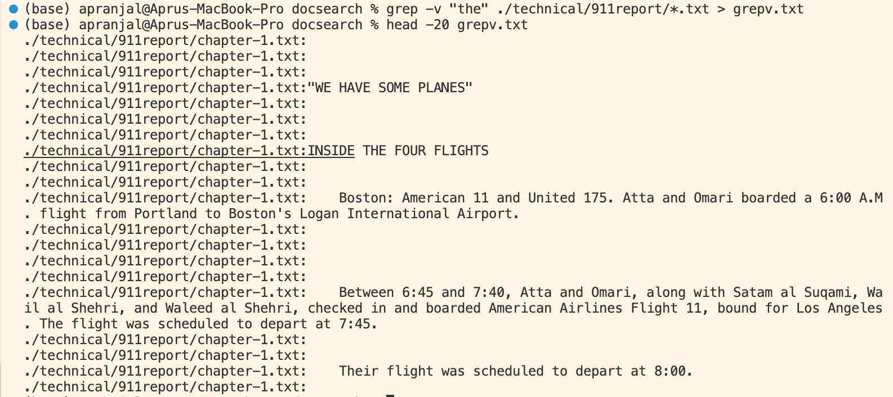
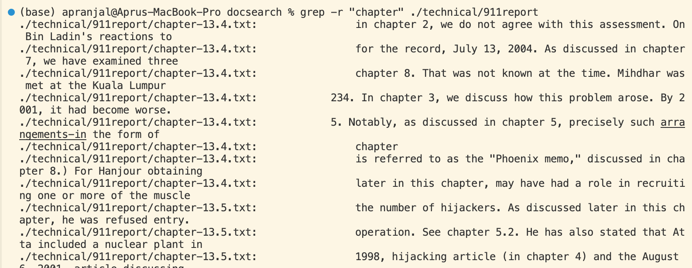
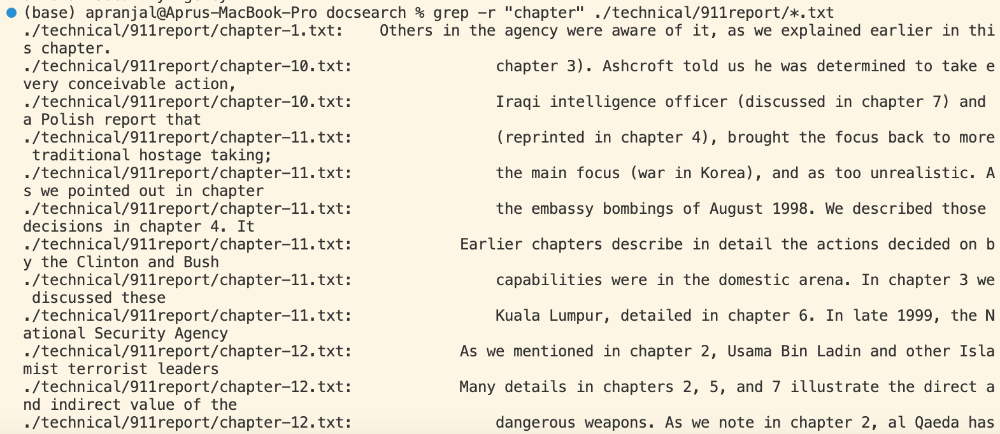
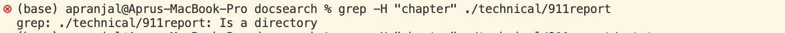
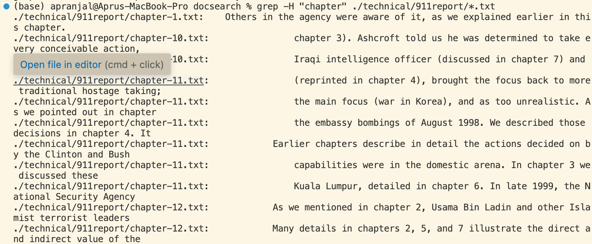

## Lab Report 3

**Part 1:**

I chose a bug from ArrayTests as my example.

a) Failure-inducing input:
```
@Test 
	public void testReverseInPlace_1() {
    int[] input1 = { 1,2,3 };
    ArrayExamples.reverseInPlace(input1);
    assertArrayEquals(new int[]{ 3,2,1 }, input1);
	}
```

b) Successful input:
```
@Test 
	public void testReverseInPlace() {
    int[] input1 = { 3 };
    ArrayExamples.reverseInPlace(input1);
    assertArrayEquals(new int[]{ 3 }, input1);
	}
```

c) Symptoms:

Running failure-inducing test:


Running succesful test:


d) Code before fixing bug:
```
static void reverseInPlace(int[] arr) {
    for(int i = 0; i < arr.length; i += 1) {
      arr[i] = arr[arr.length - i - 1];
    }
  }
```

   Code after fixing bug:
```
static void reverseInPlace(int[] arr) {
    int hold;
    for(int i = 0; i < (arr.length/2); i += 1) {
      hold = arr[i];
      arr[i] = arr[arr.length - i - 1];
      arr[arr.length - i - 1] = hold;
    }
  }
```

For the reverseInPlace() method, it was returning the original inputted array, not the new array that should be used for the reversed version of the input. Hence, a variable was created to hold the current value at the index and change the parameters for the for loop to stop once i is less than half of array’s length.

 
**Part 2:**

I chose to research command-line options for the `grep` command. The four different options I found were from this website: https://www.gnu.org/software/grep/manual/grep.html 

a) -i (ignore-case)

Example with directory:


Example with file:


This option is useful when you want to find all the instances of a word regardless of capitalization. For example when searching for the word "Chapter" and you notice that in the various files and directories it is written as "Chapter" or "chapter" this option will output all of them. 

b) -v (invert-match)

Example with directory:


Example with file:


This option is useful when selecting all the non-matching lines. For example, if you search for "the" it will return everything other than all the instances of that word.

c) -r (recursive)

Example with directory:


Example with file:


This option is useful when you want to search for a specific pattern in an entire directory tree, as it recursively searches in each directory and all its subdirectories.

d) -H (with-file)

Example with directory:


Example with file:


This option prints out the filename first and then the lines in which the specific pattern is found, useful when you want to move files or examine patterns in a larger scale.
