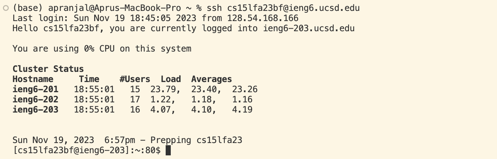
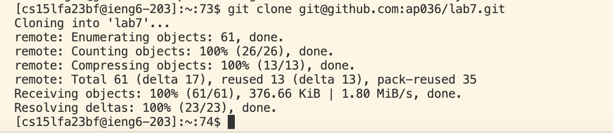
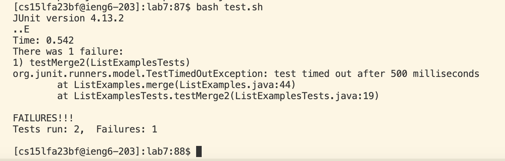
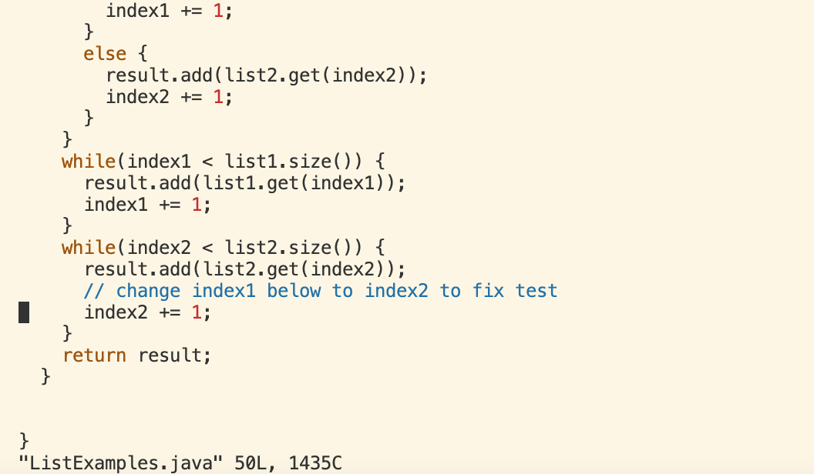
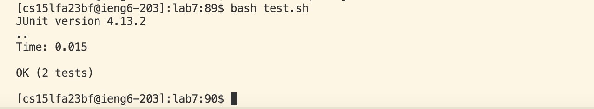
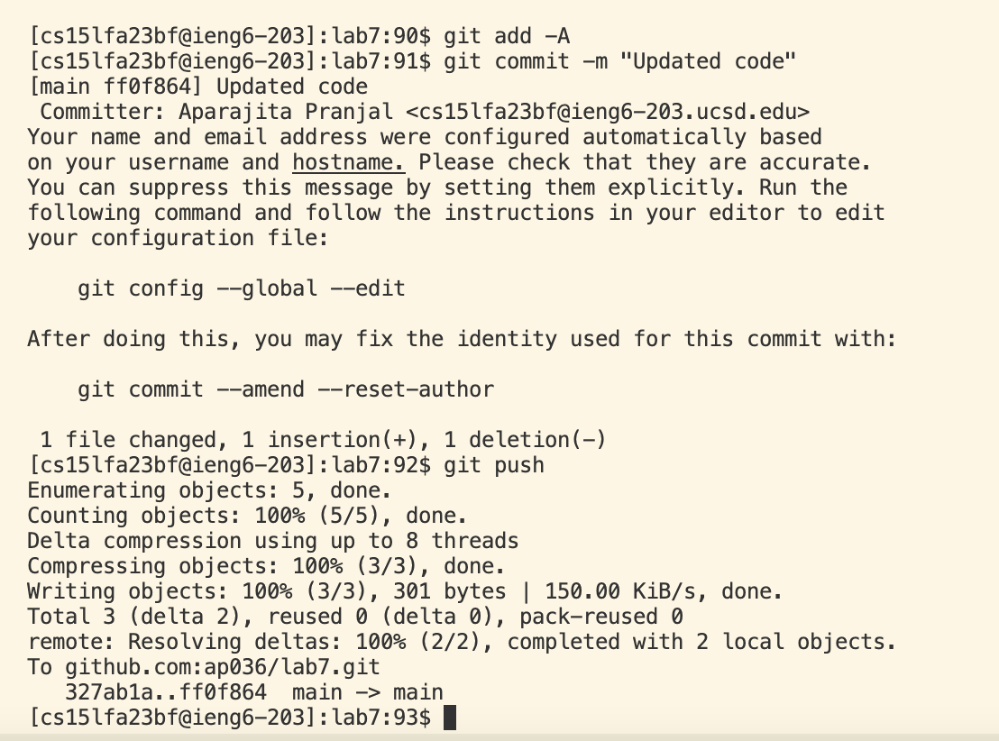

## Lab Report 4

Keys pressed for steps 4-9 of task:

Step 4:

I pressed `<tab>` 7 times to get my ssh username and pressed `<enter>`.

Step 5:

I pressed `<tab>` 9 times till I got to the line that said git clone with the copied ssh url from the forked github repository then pressed `<enter>`. Next, I pressed `<tab>` 7 to get to `cd lab7` and pressed `<enter>`.

Step 6:

I pressed `<tab>` 4 times for `bash test.sh` then `<enter>` to run the tests.

Step 7:

I pressed `<tab>` 5 times to get to `vim ListExamples.java` and pressed `<enter>`. Then the vim editor opened up where I pressed the following keys to edit the file: `<down>` 44 times, `<right>` 15 times, x, i, 2, `<esc>`, :wq

Step 8:

I pressed `<tab>` 4 times to get `bash test.sh` again and pressed `<enter>` to rerun the tests.

Step 9:

To push all my changes to the github repository I pressed the following keys:
`<tab>` 3 times till I got to `git add -A`, `<enter>`, `<tab>` 2 times I reached `git commit -m "Updated file"`, `<enter>`, `<tab>` 1 time till I got `git push`, `<enter>`.
