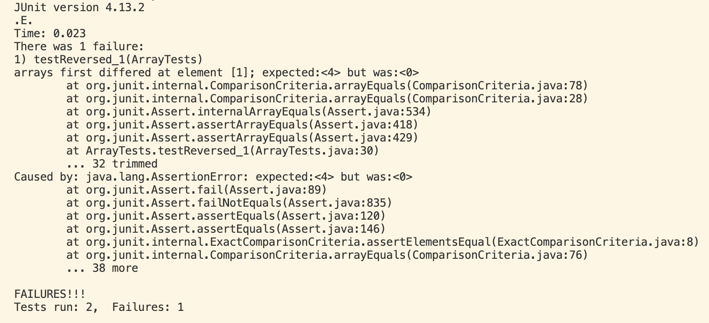
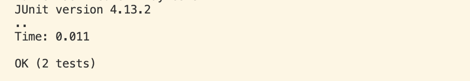

## Lab Report 5

### Part 1:

#### Student initial question:

**Failure inducing output:**


Based on the results in the method `reverse`, when reversing an array of length 5, the value at index 1 was 0 instead of 4. Is this because the for loop is not incrementing correctly or did I make a mistake in my test somehow where it adds a 0 since there is no 0 in the input array?

**TA Response:**
I think you are on the right track, double check all of the parameters in your for loop and try running the tests again.

**Student update:**

The code worked correctly this time, the bug was in the for loop, i should be incrementing by 1 instead of 2. Since the new array starts of with five 0s when the for loop is incremented by 2, the 0 is never replaced with a number at index 1.

#### Student setup:
**The file & directory structure:**

/Users/apranjal/Desktop/Github/cse15l/lab3/ArrayExamples.java 
/Users/apranjal/Desktop/Github/cse15l/lab3/ArrayTests.java
/Users/apranjal/Desktop/Github/cse15l/lab3/tests.sh

**The contents of each file before fixing the bug:**

ArrayExamples.java
```
 static int[] reversed(int[] arr) {
    int[] newArray = new int[arr.length];
    for(int i = 0; i < arr.length; i += 2) {
      newArray[i] = arr[arr.length - i - 1];
    }
    return newArray;
  }
```

ArrayTests.java
```
  @Test
  public void testReversed() {
    int[] input1 = { };
    assertArrayEquals(new int[]{ }, ArrayExamples.reversed(input1));
  }

  @Test
  public void testReversed_1() {
    int[] input1 = {1,2,3,4,5 };
    assertArrayEquals(new int[]{ 5,4,3,2,1}, ArrayExamples.reversed(input1));
  }
```

test.sh
```
javac -cp .:lib/hamcrest-core-1.3.jar:lib/junit-4.13.2.jar *.java
java -cp .:lib/hamcrest-core-1.3.jar:lib/junit-4.13.2.jar org.junit.runner.JUnitCore ArrayTests
```

**Command line arguments:**
```
cd /Users/apranjal/Desktop/Github/cse15l/lab3
bash test.sh
```

**Fixing the bug:**
The bug was in the for loop, I changed the incrementation of i from 2 to 1 and reran the tests which worked. 

### Part 2:

In the second half of the quarter, JDB was a new tool I am very glad to have learned. I was unfamiliar with it before but now I can see how useful it will be in any coding I do in the future. Additionally, I would like to improve my bash skills as many computational biology professors only use the terminal to code instead of vs code, which I think is more efficient with various the shortcuts and options available in bash.
